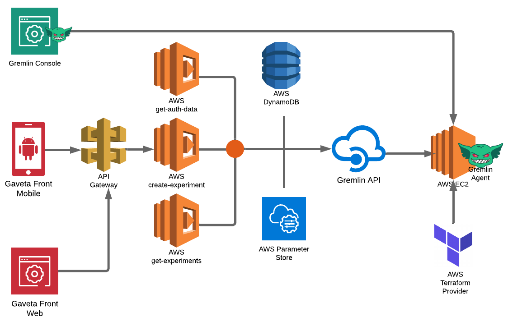

# devops-mod-aws-ec2-gremlin

[](https://www.terraform.io)
[](https://www.terraform.io)
[](https://www.gremlin.com/)

>Terraform module responsible for the creation of resources related to some Amazing Terraform Module prepared for Chaos Engineering.

## Table of Contents

- [devops-mod-aws-ec2-gremlin](#devops-mod-aws-ec2-gremlin)
  - [Table of Contents](#Table-of-Contents)
  - [Prerequisites](#Prerequisites)
  - [Diagram](#Diagram)
  - [Example usage](#Example-usage)
  - [Contributing](#Contributing)
  - [Further Reading / Useful Links](#Further-Reading--Useful-Links)

## Prerequisites

You will need the following things properly installed on your computer.

* [Git](http://git-scm.com/)
* [Terraform](https://www.terraform.io/downloads.html)

## Diagram



## Example usage

```bash
terraform init
terraform apply
```

## Contributing

If you find this repo useful here's how you can help:

1. Send a Pull Request with your awesome new features and bug fixes
2. Wait for a Coronita :beer: you deserve it.

## Further Reading / Useful Links

* [Terraform Docs](https://www.terraform.io/docs/index.html)
* [Terraform modules](https://www.terraform.io/docs/modules/usage.html)
* [Terraform Guides](https://www.terraform.io/guides/index.html)
* [Gremlin Guides](https://www.gremlin.com/docs/)
